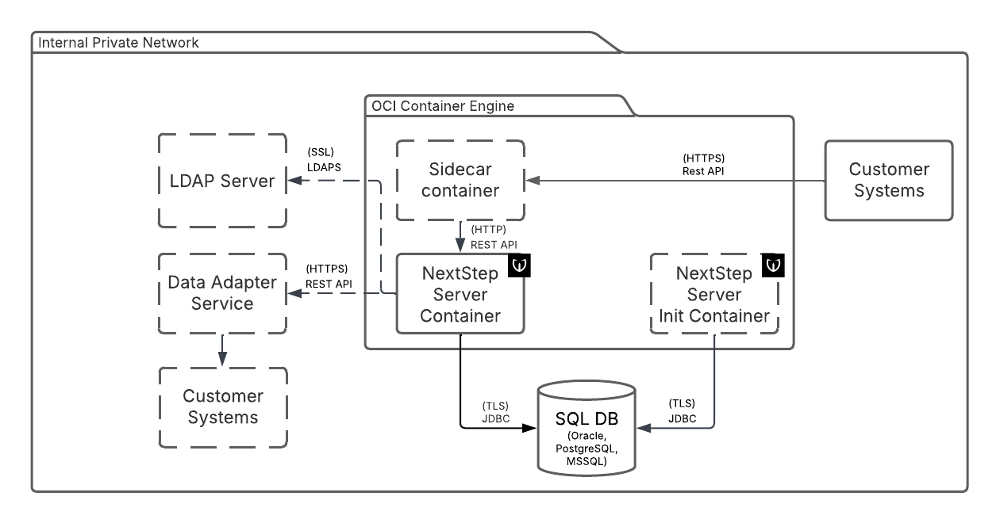

# Next Step Server Architecture

### Next Step Server Container

The container with Next Step Server application.

### SQL DB

Required external service. SQL compatible database. PostgreSQL and Oracle in LTS releases are supported.

### Customer Systems

The external systems calling the REST API of Next Step Server. The integration is always unidirectional.

### Next Step Server Init Container

The Next Step can be optionally deployed with init container. Wultra supplies the init container containing Liquibase database update scripts. The usage of the init container allows better control of deployment and also separation of a database user for schema modification from a user for application runtime.

### Sidecar Container

The Next Step can be accessed via a sidecar container for advanced ingress management. This depends on the specific deployment and is not provided by Wultra.

### LDAP Server

The Next Step can be configured to verify passwords in an external LDAP server.

### Data Adapter Service

See component [Data Adapter](./Data-Adapter.md). The Data Adapter provides optional connection to other 3rd party systems.

## Monitoring

See [Monitoring guideline](./Next-Step-Server-Monitoring.md) for detailed description how to monitor Next Step Server.