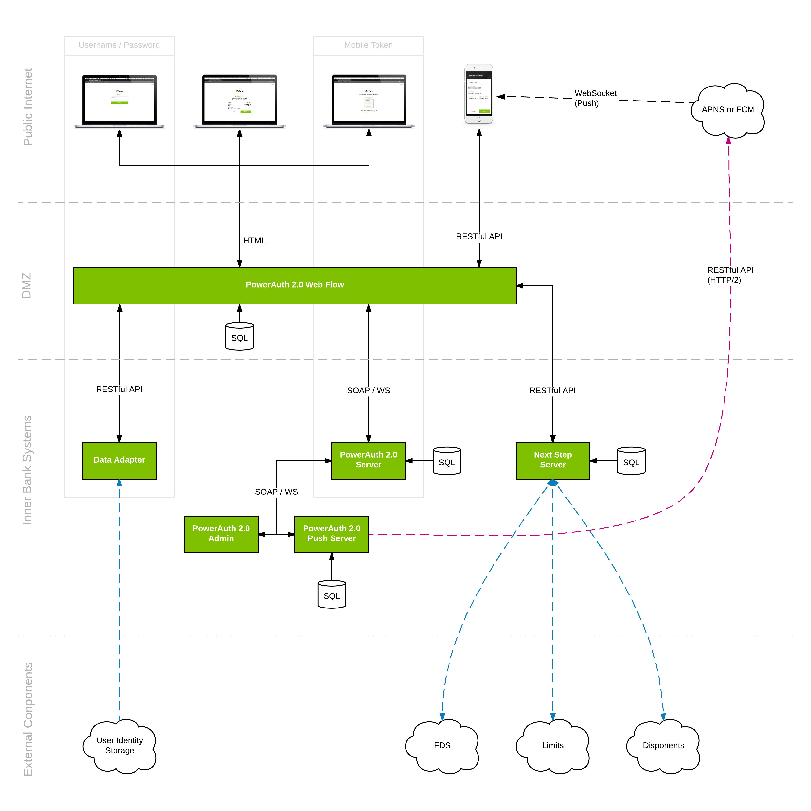

# PowerAuth Web Flow Architecture

Web Flow architecture diagram:

[Web Flow Architecture diagram in higher resolution](./img/Web_Flow_Architecture.png)

The Web Flow application consists of following components:
* **PowerAuth Web Flow** - a public internet facing web application which provides authentication and authorization services to secure target web application, the user interacts with this application using web browser
* **Next Step Server** - an internally deployed application which handles logic of resolving the next authentication/authorization step for Web Flow and optionally manages user identity, too
* **Data Adapter** - an internally deployed application which handles user authentication, provides access to user profile from client backend systems (marked as User Identity Storage on the diagram), triggers delivery of SMS messages and notifies backend systems about operation changes
* **TPP Engine** - an optional application which manages third party provider registry and consent storage (not shown on diagram, the application is deployed standalone)    
* **Mobile Token** - mobile application deployed on user device (iOS or Android), the user interacts with this application during the PowerAuth mobile token authorization step
* **PowerAuth Server** - an internally deployed application which serves as a backend providing security services for Web Flow (activation management, signature verification, token verification, etc.)
* **PowerAuth Push Server** - an internally deployed application which handles push message notifications to mobile clients (iOS or Android) for authorization of operations on user mobile devices
* **PowerAuth Admin** - an internally deployed application which is used to administer PowerAuth server
